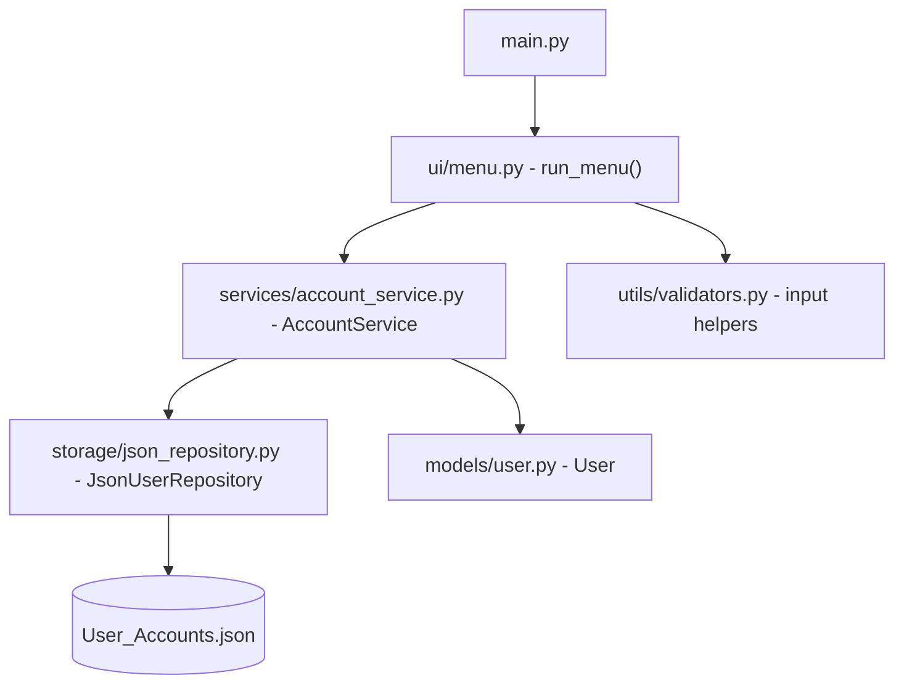
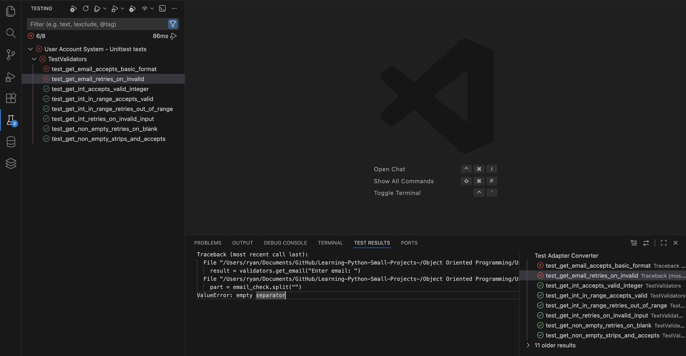
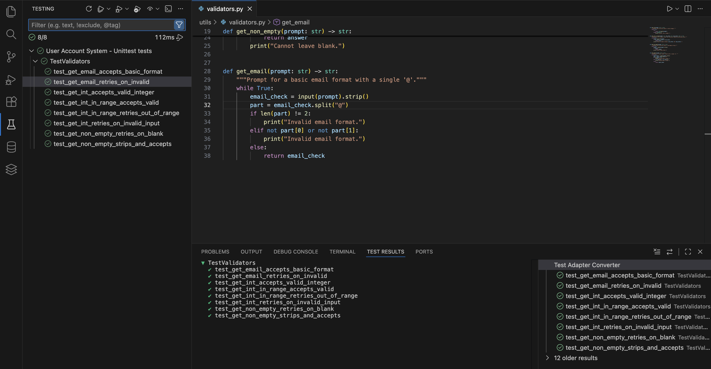

# User Account System (OOP Refactor)

This project is intentionally split into small, focused files to teach
Object-Oriented Programming (OOP) and clean architecture for beginners.
Each file has a single responsibility so it is easier to learn, test, and change.

## Index

- [Why We Changed the Structure](#why-we-changed-the-structure)
- [Project Structure](#project-structure)
- [File Responsibilities](#file-responsibilities)
- [Data Flow (High Level)](#data-flow-high-level)
- [JSON Format](#json-format)
- [How to Run](#how-to-run)
- [Textual TUI](#textual-tui)
- [How the App Connects](#how-the-app-connects)
- [Beginner Notes](#beginner-notes)
- [Common Beginner Questions](#common-beginner-questions)
- [Testing](#testing)
- [VS Code Test Explorer](#vs-code-test-explorer)
- [Test Results Screenshots](#test-results-screenshots)

## Why We Changed the Structure

In the original beginner script, one file handled:
input/output, business logic, and file saving. That makes the code
hard to read, hard to test, and hard to extend.

We split the code into layers:
- **Model**: what data looks like
- **Service**: what the app does with data
- **Storage**: how data is saved/loaded
- **UI**: how users interact with the program
- **Utils**: reusable helper functions

This separation teaches these OOP concepts:
- **Single Responsibility**: each class/module does one job
- **Encapsulation**: logic is grouped into classes
- **Abstraction**: UI talks to service, not the file system directly
- **Reuse**: helpers and models can be used in other projects

## Project Structure

```
User Account System/
├── main.py
├── models/
│   └── user.py
├── services/
│   └── account_service.py
├── storage/
│   └── json_repository.py
├── ui/
│   └── menu.py
└── utils/
    └── validators.py
```

## File Responsibilities

### `main.py` (Entry Point)
Creates the app objects and starts the menu.

- Builds the repository, service, and UI
- Calls `run_menu(...)`

### `models/user.py` (Data Model)
Defines the **User** data class.

- A **dataclass** stores data in a clean, simple way
- `to_dict()` converts a `User` to JSON-friendly data
- `from_dict()` converts JSON back into a `User`

**Why dataclasses?**
- Less boilerplate code
- Automatic `__init__`, `__repr__`, and comparisons
- Clear intent: this class holds data

### `storage/json_repository.py` (Persistence)
Handles saving and loading data to `User_Accounts.json`.

- `load_all()` reads from the JSON file
- `save_all(users)` writes a list of `User` objects to disk

**Why isolate storage?**
- The rest of the app doesn't care *how* data is saved
- You could swap JSON for a database later without changing the UI

### `services/account_service.py` (Business Logic)
Contains the "actions" your program can do.

- `add_user(user)` adds a new user
- `remove_user_by_index(index)` removes a user
- `list_users()` returns all users
- `search_by_social(social)` and `search_by_name(name)` find matches

**Why a service layer?**
- UI stays simple
- Logic stays reusable and testable

### `ui/menu.py` (User Interaction)
Handles all input and print statements.

- Shows the menu
- Collects user data
- Calls service methods

**Why isolate UI?**
- Business logic does not depend on `input()` or `print()`
- Easy to replace with a GUI or web interface later

### `utils/validators.py` (Input Validation)
Reusable functions to keep input clean.

- `get_int()` and `get_int_in_range()` for numeric input
- `get_non_empty()` for text input
- `get_email()` for basic email format checking

**Why separate validators?**
- Avoid repeated code
- Keeps UI code short and readable

## Data Flow (High Level)

1. `main.py` creates a repository and service.
2. `run_menu()` asks the user for input.
3. The UI builds a `User` object.
4. The service saves it using the repository.
5. Data is stored in `User_Accounts.json`.

## JSON Format

The current JSON format looks like this:

```json
{
  "users": [
    {
      "social": "Instagram",
      "first_name": "Jane",
      "last_name": "Doe",
      "email": "jane@example.com",
      "password": "password123"
    }
  ]
}
```

Older files with keys like `user_account`, `firstname`, and `lastname` still
load correctly because the repository normalizes legacy keys.

## How to Run

```bash
python main.py
```

## Textual TUI

This project also includes a Textual-based TUI that feels more like an app.

### Install Textual

- macOS/Linux:

```bash
python -m pip install textual
```

- Windows:

```bash
py -m pip install textual
```

### Run the TUI

```bash
python tui_app.py
```

If you do not want to install Textual, you can keep using the CLI with `main.py`.

## How the App Connects



## Beginner Notes

- This project stores passwords in plain text. That is **not** safe in real life.
  It is done here only to keep the learning project simple.
- Focus on understanding **responsibility**: each file has one job.
- If you want to add a new feature, decide which layer it belongs to:
  - UI change? Update `ui/menu.py`
  - New business rule? Update `services/account_service.py`
  - New data field? Update `models/user.py` and repository

## Common Beginner Questions

**Why not put everything in one class?**
Because real projects grow. Splitting files makes code easier to test and change.

**Why do we use `User` objects instead of dictionaries everywhere?**
Objects give us structure and make it easier to add behavior later.

**Why does the UI call the service instead of saving JSON directly?**
So the UI doesn't need to know about file formats or storage details.

## Testing

### Why we test

Tests give us fast feedback and protect our code when we change it.
For beginners, tests are also a way to prove that your logic is correct.

### How we test

We use Python's built-in `unittest`, plus `assertpy` for fluent assertions, and
`unittest.mock` for patching input:
- `unittest` is the standard testing library (no installs needed).
- `assertpy` makes assertions read like sentences.
- `unittest.mock.patch` lets us fake `input()` so we can test input-based code.

### How to run the tests

From the project root (first install `assertpy`):

```bash
python -m pip install assertpy
```

Then run:

```bash
python -m unittest discover -s tests -p "test_*.py" -v
```

## VS Code Test Explorer

### Install the test dependency

- macOS/Linux:

```bash
python -m pip install assertpy
```

- Windows:

```bash
py -m pip install assertpy
```

### Select the Python interpreter

1. Open the Command Palette (`Cmd+Shift+P` or `Ctrl+Shift+P`).
2. Choose **Python: Select Interpreter**.
3. Pick the same Python you use in the terminal.

### Discover and run tests

1. Open the **Testing** panel (beaker icon).
2. Click **Refresh** to discover tests.
3. Run all tests or a single test from the tree.

## Test Results Screenshots
### Failed test example



### Passing tests example



### Try breaking a test on purpose

1. Open `utils/validators.py`.
2. Change `get_email()` so it **always** returns the input without checking for `@`.
3. Run the tests again:

```bash
python -m unittest
```

You should see a failure in `tests/test_validators.py`.
That failure tells you your change broke the expected behavior.

### What this teaches

- Tests act like a safety net.
- Small, focused functions are easier to test.
- If a test breaks, it tells you **what** you changed and **where**.

